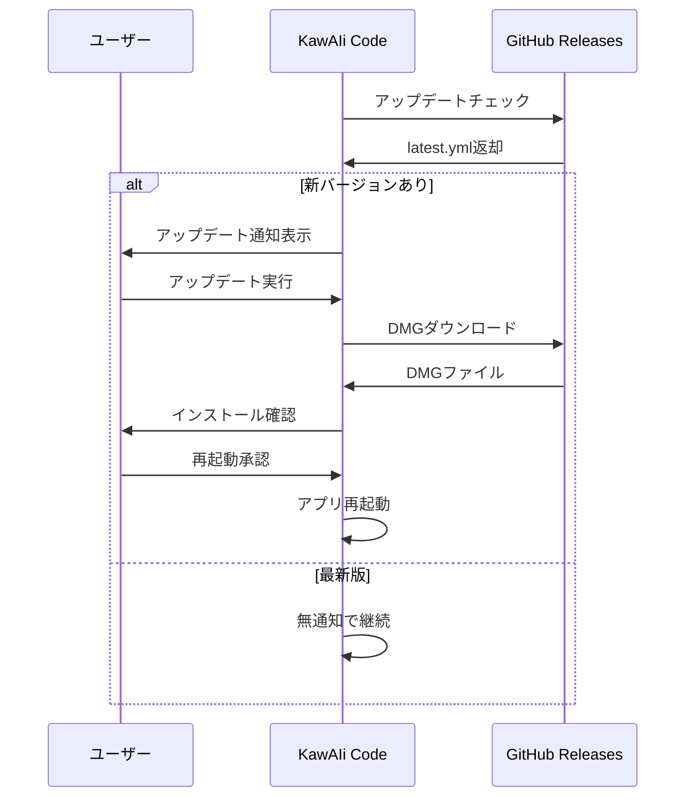

# 🔄 KawAIi Code - 自動アップデート機能実装計画

**作成日**: 2025-07-28  
**対象アプリ**: KawAIi Code v1.0.0  
**実装方式**: GitHub Releases + electron-updater

---

## 📋 実装概要

現在のKawAIi Codeに自動アップデート機能を追加し、ユーザーが手動でダウンロード・インストールする手間を削減する。

### 🎯 目標
- ユーザビリティ向上（ワンクリックアップデート）
- 最新版への移行促進
- セキュリティアップデートの迅速な配布

---

## 🛠️ 技術スタック

### 使用ライブラリ
- **electron-updater**: Electronアプリの自動アップデート
- **GitHub Releases**: アップデートファイル配信

### 配信方式
- **GitHub Releases**: 既存のリポジトリを活用
- **DMGファイル**: 現在のビルド成果物をそのまま利用

---

## 📈 実装手順

### Phase 1: 基盤実装 (1-2時間)

#### 1.1 依存関係追加
```bash
npm install electron-updater --save
```

#### 1.2 package.json設定更新
```json
{
  "build": {
    "publish": [
      {
        "provider": "github",
        "owner": "naolab",
        "repo": "KawAIi-Code"
      }
    ],
    "generateUpdatesFilesForAllChannels": true
  }
}
```

#### 1.3 main.js - 自動アップデート実装
```javascript
const { autoUpdater } = require('electron-updater');

// アップデートチェック設定
autoUpdater.checkForUpdatesAndNotify();

// イベントハンドラー
autoUpdater.on('update-available', () => {
  // アップデート通知UI表示
});

autoUpdater.on('update-downloaded', () => {
  // インストール確認ダイアログ
});
```

### Phase 2: UI実装 (2-3時間)

#### 2.1 アップデート通知UI
- **位置**: 設定画面内
- **デザイン**: 既存UIと統一
- **機能**: 
  - アップデート可否表示
  - 手動チェックボタン
  - プログレスバー

#### 2.2 確認ダイアログ
- **タイミング**: アップデートダウンロード完了時
- **選択肢**: 「今すぐ再起動」「後で」
- **情報表示**: バージョン番号、更新内容

### Phase 3: 配信設定 (1時間)

#### 3.1 GitHub Actions設定
```yaml
name: Build and Release
on:
  push:
    tags:
      - 'v*'
jobs:
  release:
    runs-on: macos-latest
    steps:
      - name: Build and publish
        run: |
          npm run build
          npm run publish
```

#### 3.2 リリースプロセス
1. バージョンタグ作成: `git tag v1.0.1`
2. 自動ビルド・配信
3. latest.yml生成（electron-updater用）

---

## 🔧 詳細実装仕様

### 自動アップデートフロー



### 設定項目追加

#### appConfig.js拡張
```javascript
const updateConfig = {
  autoCheck: true,          // 起動時自動チェック
  checkInterval: 3600000,   // 1時間間隔
  downloadInBackground: true, // バックグラウンドDL
  notifyOnUpdate: true      // 更新通知
};
```

### UI統合ポイント

#### 設定画面追加項目
- **アップデート設定**: 自動チェックON/OFF
- **現在のバージョン**: v1.0.0表示
- **手動チェック**: 「アップデートを確認」ボタン
- **アップデート状況**: 「最新版です」「ダウンロード中...」

---

## 🚨 注意事項・考慮点

### セキュリティ
- **署名検証**: DMGファイルの署名確認
- **HTTPS通信**: GitHub Releases(HTTPS)なので安全
- **ダウンロード検証**: SHA256ハッシュチェック

### ユーザー体験
- **非強制**: アップデートは任意実行
- **ロールバック**: 必要に応じて旧バージョン保持
- **ネットワーク負荷**: Wi-Fi接続時のみ自動DL推奨

### 開発・運用
- **バージョン管理**: セマンティックバージョニング遵守
- **テスト**: ステージング環境でアップデート動作確認
- **ロールアウト**: 段階的配信（ベータ→一般）

---

## 📊 実装優先度

| 項目 | 優先度 | 工数 | 備考 |
|------|--------|------|------|
| 基本自動アップデート | 🔥 High | 2h | 最小機能 |
| UI統合 | 🔥 High | 3h | ユーザビリティ |
| 設定保存 | 🟡 Medium | 1h | カスタマイズ |
| バックグラウンドDL | 🟡 Medium | 2h | UX向上 |
| ベータチャンネル | 🔵 Low | 3h | 上級者向け |

---

## 🎯 成功指標

### 技術指標
- **アップデート成功率**: 95%以上
- **ダウンロード時間**: 5MB/分以上
- **UI応答性**: アップデート中も操作可能

### ユーザー指標
- **アップデート実行率**: 70%以上
- **エラー報告**: 月5件以下
- **満足度**: アンケート4.0/5.0以上

---

## 🔄 実装後の運用

### リリースプロセス
1. **開発完了**: 機能実装・テスト
2. **バージョン更新**: package.json更新
3. **タグ作成**: `git tag v1.x.x`
4. **自動配信**: GitHub Actions実行
5. **動作確認**: アップデート通知確認

### 監視・メンテナンス
- **GitHub Releases容量**: 定期的な古いリリース削除
- **エラー監視**: アップデート失敗ログ収集
- **ユーザーフィードバック**: GitHub Issues監視

---

**実装担当**: 開発チーム  
**レビュー**: セキュリティ監査後実装推奨  
**完了予定**: Phase 1-2完了後、Phase 3で本格運用開始